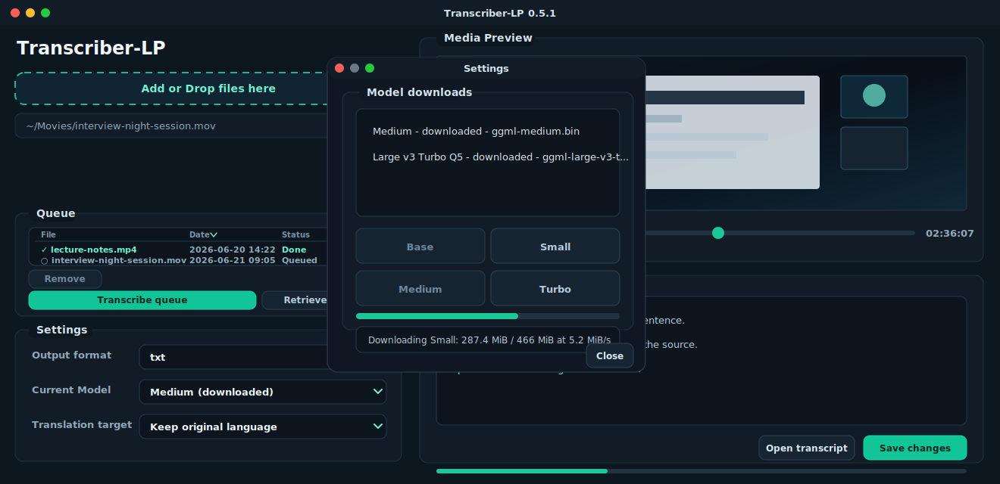

# Transcriber-LP

[](https://github.com/garibald75/Transcriber-LP/actions/workflows/ci.yml)


Current version: `0.4.16`

An AI-powered, local-first macOS transcription app that turns audio and video into editable text using Whisper, an automatic speech recognition AI model. It runs on-device ML inference through `whisper.cpp`, with FFmpeg media processing and a native PySide6 desktop workflow.

## Project highlights

- AI speech-to-text pipeline based on Whisper automatic speech recognition, with local ML model execution and no hosted backend or user media upload.
- Privacy-conscious AI pipeline: media extraction, transcription, model selection, and transcript review stay on the user's machine.
- Native desktop UI with drag and drop, batch import, unified Settings dropdowns, language controls, output format selection, media preview, quick transcript editing, theme switching, progress, cancellation, and help dialogs.
- Local model management with checksum-gated downloads from the Settings dialog.
- Automated Python syntax checks and unit tests through GitHub Actions.
- macOS packaging flow with target-specific third-party binary, model, and license provenance.

## What this project is

- Desktop UI built with PySide6.
- AI/ML-powered transcription through the `whisper.cpp` CLI.
- Audio extraction through `ffmpeg`.
- macOS packaging through PyInstaller.
- Optional model downloads stored in the user's Application Support directory.
- Offline-capable workflow with no server requirement.

The repository intentionally does not commit runtime binaries, model weights, virtual environments, or build products. Packaging inputs must be supplied locally under `third_party/macos/` or a target-specific subdirectory before building.

## Features

- drag & drop media input
- visible `Browse file...` button for media selection
- batch import queue for sequential transcription of multiple media files
- output formats: `txt`, `srt`, `vtt`
- optional timestamp CSV sidecar export independent of the selected transcript format
- source language selection or auto-detect
- translate to English or keep the source language
- `Current Model` selector with a first-run download placeholder that opens model downloads in Settings
- media preview player for reviewing the original source while correcting a transcript
- quick transcript editor with overwrite confirmation before saving corrected `txt`, `srt`, and `vtt` files
- batch status logging and output retrieval for completed queue items
- stop/cancel for running jobs
- light/dark theme switch from `View > Theme`
- runtime help manual and open-source notice dialog
- GitHub CI for syntax and unit-test validation

## Versioning

Transcriber-LP uses semantic versioning starting at `0.1.0`.

- `0.x` releases are early public-ready builds where UI, packaging, and workflow details may still change.
- Patch releases fix bugs or documentation without changing behavior.
- Minor releases add user-visible features or packaging improvements.

The source of truth is `app/version.py`. macOS bundle metadata is read from that file during PyInstaller builds.

## Screenshot



## Appearance

The app defaults to the light theme. Use `View > Theme > Light` or `View > Theme > Dark` to switch the interface theme at runtime.

The selected theme is stored in the user settings and restored on the next launch. The theme system is palette-driven in `app/ui/main_window.py`, so new themes can be added by defining another entry in `THEME_PALETTES` and exposing it through the theme menu.

Interactive controls use explicit hover and focus states. Actions are enabled only when they apply to the current workflow state: transcription requires a selected file and model, the main Stop button appears only during transcription, and media/player actions follow the loaded media state. Dropdown menus highlight the item under the mouse, the media browser control is styled as a button, and the log panel includes a persistent `Auto-scroll` checkbox with a visible checked marker.

## Language handling

The source language selector is passed directly to `whisper-cli`. `Auto-detect` is sent as `-l auto`, while explicit selections such as Italian are sent with the corresponding language code, for example `-l it`.

For known-language recordings, selecting the language explicitly is recommended because it avoids model-side misclassification on long or noisy audio.

## Third-party components and licenses

- `ffmpeg` / `ffprobe`: LGPL/GPL-licensed media toolkit. Verify the upstream build license before bundling. See https://ffmpeg.org/legal.html
- `whisper.cpp` / `whisper-cli`: upstream project by Georgi Gerganov and contributors, typically licensed under MIT. See https://github.com/ggml-org/whisper.cpp
- `PySide6`: Qt for Python, licensed under LGPL. See https://doc.qt.io/qtforpython/
- `requests`: Apache License 2.0.
- Models (for example `ggml-base.bin`): may have separate licensing and distribution requirements.

This repository avoids committing binary distributions and model weights. Runtime binaries are supplied from `third_party/macos/` before packaging, and should only be added when their licenses are compatible with the distribution plan. The default macOS bundle does not include model weights; when no local model is present, `Current Model` shows a placeholder that opens Settings for a checksum-verified model download.

Apple, macOS, Mac, Finder, and Apple Silicon are trademarks of Apple Inc. Platform references in this repository are descriptive compatibility notes only; Transcriber-LP is not affiliated with, endorsed by, or sponsored by Apple Inc. See `docs/THIRD_PARTY_NOTICE.md`.

Transcriber-LP source code is licensed under the MIT License. See `LICENSE`.
Before publishing a packaged app, complete `docs/FFMPEG_BUILD.md`, `docs/MODEL_PROVENANCE.md`, `docs/RELEASE_COMPLIANCE.md`, and `docs/DISTRIBUTION_CHECKLIST.md`.

## Repository structure

- `app/` application source code
- `app/assets/` UI and icon assets (including a new SVG app icon)
- `tests/` unit tests and import checks
- `docs/USER_MANUAL.md` end-user manual
- `docs/THIRD_PARTY_NOTICE.md` open-source owners, licenses, and redistribution policy
- `docs/RELEASE_COMPLIANCE.md` release policy for binaries, models, and license texts
- `docs/DISTRIBUTION_CHECKLIST.md` release readiness checklist
- `docs/TECHNICAL_REVIEW.md` implementation notes for technical review
- `scripts/` packaging and helper scripts
- `third_party/macos/` local packaging inputs; only `.gitkeep` placeholders are tracked
- `.github/workflows/` CI pipeline

## Quick start

1. Create a Python virtual environment:

```bash
python3 -m venv .venv
source .venv/bin/activate
```

2. Install dependencies:

```bash
pip install -r requirements.txt
```

3. Run the app:

```bash
python -m app.main
```

## macOS build targets

The repository can build macOS app bundles for the target chosen by the person building it. Runtime binaries are not committed, so each builder supplies compatible local inputs first.

Supported targets:

- `arm64` for Apple Silicon
- `x86_64` for Intel Macs
- `universal2` for a real two-architecture bundle

Place target-specific inputs in one of these directories:

```text
third_party/macos/arm64/
third_party/macos/x86_64/
third_party/macos/universal2/
```

Each target directory must contain:

- `ffmpeg`
- `ffprobe`
- `whisper-cli`
- any `@rpath` `.dylib` dependencies reported by `otool -L whisper-cli`

The legacy flat directory `third_party/macos/` is still accepted for local one-target builds, but target-specific directories are preferred because they avoid mixing incompatible binaries.

Build commands:

```bash
bash scripts/build_macos.sh arm64
bash scripts/build_macos.sh x86_64
bash scripts/build_macos.sh universal2
```

`scripts/build_macos_auto.sh` builds for the current Mac architecture. `scripts/build_macos_intel.sh` and `scripts/build_macos_universal.sh` are compatibility wrappers around `scripts/build_macos.sh`.

Before PyInstaller runs, `scripts/validate_macos_vendor.sh` checks that the supplied binaries and bundled `.dylib` files match the selected target. For `universal2`, the inputs must already be universal2; the build script does not create a fake universal app by combining only the launcher executable.

To override the vendor input directory:

```bash
TRANSCRIBER_LP_VENDOR_DIR=/path/to/vendor bash scripts/build_macos.sh arm64
```

The default build does not bundle model weights. To include `ggml-base.bin`, place it in the selected vendor directory under `models/` and build with:

```bash
TRANSCRIBER_LP_BUNDLE_MODEL=1 bash scripts/build_macos.sh arm64
```

Only use `TRANSCRIBER_LP_BUNDLE_MODEL=1` after completing `docs/MODEL_PROVENANCE.md` and including the required model license/provenance notices in the release artifact.

The application bundle is created in `dist/Transcriber-LP.app`. If the bundle is prepared for distribution, build or export it outside cloud-synced folders such as OneDrive and run:

```bash
codesign --verify --deep --strict --verbose=2 dist/Transcriber-LP.app
```

## Other platforms

Official packaged releases currently target macOS Apple Silicon.

Linux and Windows users can run Transcriber-LP from source if they provide compatible `ffmpeg`, `ffprobe`, and `whisper-cli` binaries for their platform. Platform-specific packaged builds are not included yet.

Community contributions for Linux, Windows, Intel macOS, and other packaging targets are welcome. Good contributions should include:

- a documented build script, for example `scripts/build_linux.sh` or `scripts/build_windows.ps1`
- platform-specific third-party binary locations, for example `third_party/linux/` or `third_party/windows/`
- updated license and provenance notes for bundled binaries
- local test notes or CI coverage for the new platform

Until those flows are tested and documented, non-macOS packages should be treated as community-supported rather than official release artifacts.

## Testing and CI

A GitHub Actions workflow is provided in `.github/workflows/ci.yml`.
The CI pipeline performs:

- checkout repository
- install Python dependencies
- compile all Python sources under `app/`
- run unit tests in `tests/`

Run tests locally with:

```bash
python -m unittest discover tests
```

For the same checks as CI, also run:

```bash
find app -name '*.py' | sort | xargs python -m py_compile
python -m unittest discover tests
```

If the checkout is inside a cloud-synced folder and Python cannot write its cache files, set `PYTHONPYCACHEPREFIX` to a local temporary directory before running `py_compile`.

## Known Issues

### Language Detection Switching (Whisper.cpp)

When using `Auto-detect` for source language on some audio files, Whisper.cpp may misclassify the language initially and then switch mid-transcription (e.g., starting in Italian but switching to English).

**Workaround:** Manually select the correct source language in the "Source language" dropdown instead of using `Auto-detect`. This forces the model to process the audio as that language from the start, avoiding detection errors.

**Example:**
- For Italian audio: Select "Italian" instead of "Auto-detect"
- For English audio: Select "English" instead of "Auto-detect"

This is particularly useful for recordings with:
- Accented speech
- Background noise
- Mixed-language content
- Longer audio files

See `docs/USER_MANUAL.md` for more details on language selection.

## Runtime paths

- downloaded models: `~/Library/Application Support/Transcriber-LP/models`
- outputs: `~/Library/Application Support/Transcriber-LP/outputs`
- temporary files: `~/Library/Application Support/Transcriber-LP/tmp`

## Notes

- The app currently targets macOS packaging and does not include Windows/Linux installers.
- The repo is configured to keep binary artifacts out of version control.
- The UI includes light/dark themes, tooltips, and inline help.
- The app includes `Help > Open-source licenses` and `docs/THIRD_PARTY_NOTICE.md` to cite third-party owners and licenses.
- Release artifacts should include exact third-party license texts and provenance for bundled binaries and models.
- Generated transcripts, subtitles, edited files, batch results, and timestamp CSV sidecars are local user outputs. They should not be included in public release artifacts unless they are intentional sample assets with clear provenance and consent.
