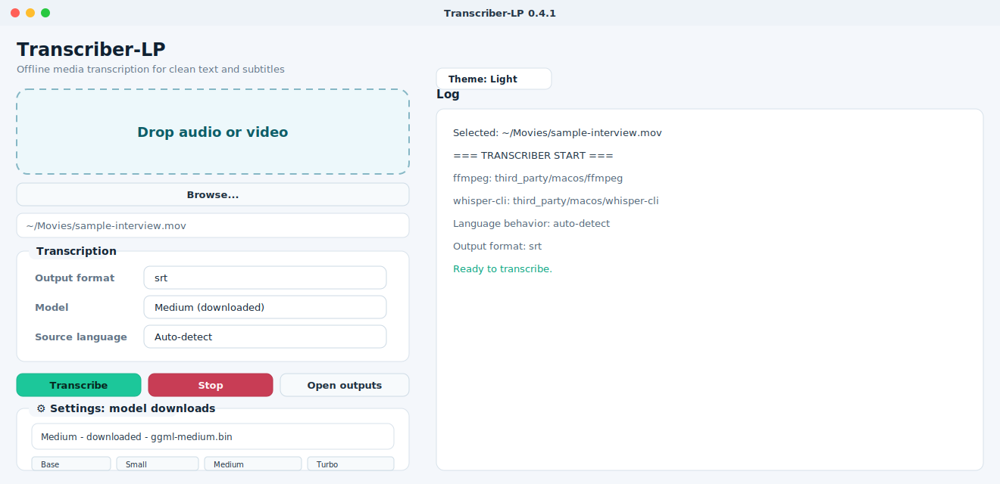

# Transcriber-LP

[](https://github.com/garibald75/Transcriber-LP/actions/workflows/ci.yml)


Current version: `0.1.0`

Offline desktop transcription app for macOS, built with PySide6 and `whisper.cpp`.

## What this project is

- Desktop UI: PySide6
- Packaging: PyInstaller
- Speech engine: `whisper.cpp` CLI
- Audio extraction: `ffmpeg`
- Default bundled model: `ggml-base.bin`
- Optional downloadable models stored outside the app bundle
- No server required, offline-capable transcription

## Features

- drag & drop media input
- file browser selection
- output formats: `txt`, `srt`, `vtt`
- choose source language or auto-detect
- translate to English or keep original language
- model manager with downloadable models
- stop/cancel transcription in progress
- runtime help manual and tooltips
- GitHub CI for syntax + import validation

## Versioning

Transcriber-LP uses semantic versioning starting at `0.1.0`.

- `0.x` releases are early public-ready builds where UI, packaging, and workflow details may still change.
- Patch releases fix bugs or documentation without changing behavior.
- Minor releases add user-visible features or packaging improvements.

The source of truth is `app/version.py`. macOS bundle metadata is read from that file during PyInstaller builds.

## Screenshot



## Third-party components and licenses

- `ffmpeg` / `ffprobe`: LGPL/GPL-licensed media toolkit. Verify the upstream build license before bundling. See https://ffmpeg.org/legal.html
- `whisper.cpp` / `whisper-cli`: upstream project by Georgi Gerganov and contributors, typically licensed under MIT. See https://github.com/ggml-org/whisper.cpp
- `PySide6`: Qt for Python, licensed under LGPL. See https://doc.qt.io/qtforpython/
- `requests`: Apache License 2.0.
- Models (for example `ggml-base.bin`): may have separate licensing and distribution requirements.

This repository avoids committing binary distributions and model weights. Runtime binaries are supplied from `third_party/macos/` before packaging, and should only be added when their licenses are compatible with your distribution plan.

Transcriber-LP source code is licensed under the MIT License. See `LICENSE`.
Before publishing a packaged app, complete `docs/FFMPEG_BUILD.md`, `docs/MODEL_PROVENANCE.md`, and `docs/DISTRIBUTION_CHECKLIST.md`.

## Repository structure

- `app/` application source code
- `app/assets/` UI and icon assets (including a new SVG app icon)
- `tests/` unit tests and import checks
- `docs/USER_MANUAL.md` end-user manual
- `docs/THIRD_PARTY_NOTICE.md` open-source owners, licenses, and redistribution policy
- `docs/DISTRIBUTION_CHECKLIST.md` release readiness checklist
- `scripts/` packaging and helper scripts
- `third_party/macos/` required runtime binaries before packaging
- `.github/workflows/` CI pipeline

## Quick start

1. Create a Python virtual environment:

```bash
python3 -m venv .venv
source .venv/bin/activate
```

2. Install dependencies:

```bash
pip install -r requirements.txt
```

3. Run the app:

```bash
python -m app.main
```

## macOS M1 build

Ensure these files are present before building:

- `third_party/macos/ffmpeg`
- `third_party/macos/ffprobe`
- `third_party/macos/whisper-cli`
- `third_party/macos/models/ggml-base.bin`

Then run:

```bash
bash scripts/build_macos.sh
```

The application bundle is created in `dist/Transcriber-LP.app`.

## Intel / universal build

The current packaging is targeted for Apple Silicon (`arm64`).
For Intel support, build with a universal2 Python environment and compatible binaries, or use a separate Intel-specific build environment.

## Testing and CI

A GitHub Actions workflow is provided in `.github/workflows/ci.yml`.
The CI pipeline performs:

- checkout repository
- install Python dependencies
- compile all Python sources under `app/`
- run unit tests in `tests/`

Run tests locally with:

```bash
python -m unittest discover tests
```

## Runtime paths

- downloaded models: `~/Library/Application Support/Transcriber-LP/models`
- outputs: `~/Library/Application Support/Transcriber-LP/outputs`
- temporary files: `~/Library/Application Support/Transcriber-LP/tmp`

## Notes

- The app currently targets macOS packaging and does not include Windows/Linux installers.
- The repo is configured to keep binary artifacts out of version control.
- The UI includes tooltips and an inline help manual for a better user experience.
- The app includes `Help > Open-source licenses` and `docs/THIRD_PARTY_NOTICE.md` to cite third-party owners and licenses.
- Release artifacts should include exact third-party license texts and provenance for bundled binaries and models.
