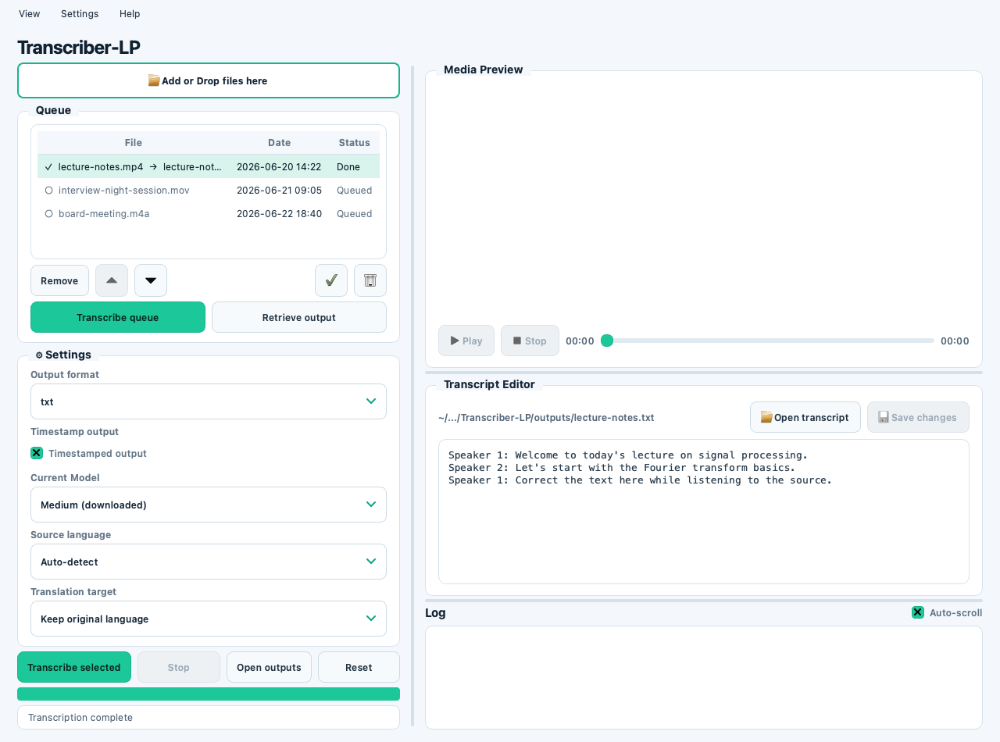

# Transcriber-LP User Manual

Current version: `0.7.1`

Versioning starts at `0.1.0` for the first tracked public-ready baseline. The source of truth is `app/version.py`.

## Start the App

Run the app from a development environment with:

```bash
python -m app.main
```

For a packaged build, open `dist/Transcriber-LP.app`.

## Interface Preview



## Transcribe a File

1. Drag one or more audio/video files anywhere onto the left panel, or click `Add or Drop files here` to pick several at once. While you drag files over the panel, a highlighted overlay fades in to show the drop target. Every file joins the **Queue** and stays there. Files dropped together are added oldest-to-newest by file date.
2. Choose the output format: `txt`, `srt`, or `vtt`.
3. Select a model from the model list.
4. Leave source language on `Auto-detect`, or choose a known language.
5. Keep the original language, or choose `Translate to English`.
6. Enable `Timestamped output` if you want timecodes in `txt` output and a timestamp CSV sidecar.
7. Select a file in the queue and click `Transcribe selected` to transcribe only that file, or click `Transcribe queue` to process every not-yet-done file in sequence. (The button reads `Transcribe` while nothing is selected.)
8. Choose the output folder when prompted.

Use `Stop` to cancel a running transcription. Use `Reset` to start a new session: after confirmation it empties the queue, unloads the media preview, clears the transcript editor, and resets the progress bar. Output files already saved on disk are not affected.

## The Queue

Single-file and batch transcription share one **Queue**. Drag and drop (anywhere on the left panel) and the `Add or Drop files here` picker both add files to it, and files **stay in the queue after transcribing** instead of disappearing.

When several files are dragged in at once, they are added in chronological order by file date (oldest first).

The queue is a table with three columns: **File**, **Date**, and **Status**. Click any column header to sort the whole queue by that column (click again to reverse the order). You can also reorder the queue manually: drag a row to a new position, use the up/down arrow buttons next to `Remove`, or right-click a row and choose **Sposta su** / **Sposta giù**. Manual reordering replaces any active column sort. Both sorting and reordering are disabled while a transcription is running. Each row's **File** cell shows a status glyph next to the file name:

- `○` queued
- `▶` transcribing
- `✓` done (the row also shows the generated output file name)
- `✗` failed
- `⊘` cancelled

`Transcribe queue` asks for one output folder, then processes every file that is **not already done** in sequence with the current model, language, translation, and output format settings. Files that already show `✓` are skipped, so re-running the queue does not redo finished work. The progress bar shows `X / Y` and the status line names the file currently being transcribed and how many are done.

Queue controls:

- **Remove** — remove the selected file from the queue.
- **Move up / Move down** (arrow icons) — move the selected file one position up or down; you can also drag rows to reorder.
- **Clear done** (✓ icon, bottom-right) — remove all completed (`✓`) files from the queue.
- **Clear all** (trash icon, bottom-right) — empty the queue.
- **Retrieve output** — select a completed item (or double-click it) to load its source media in the preview player and open the generated transcript in the editor.

To see a file's full path and details, hover a row for a tooltip, or right-click it and choose **Informazioni file** for a dialog with the name, full path, status, date, size, and (when present) the output file name and any error.

If multiple queued files share the same base filename, queue output names include a numeric suffix to avoid overwriting earlier files.

## Timestamp Export

`Timestamped output` adds timecodes to each line when the selected output format is `txt`. `srt` and `vtt` outputs already include timecodes in the main file.

The option also saves a `.csv` sidecar next to the main transcript using the same base filename. Treat it like the transcript itself: it can contain timing information and recognized text from the source media.

## Review and Correct a Transcript

When a media file is selected, the right side of the app loads it in the media preview player. Use `Play`, `Stop`, and the seek slider to review the source audio or video while checking the generated text.

When a transcription completes, the generated `txt`, `srt`, or `vtt` file opens automatically in the transcript editor. Correct the text directly and click `Save changes`; confirm the overwrite dialog to write the edits back to the same file.

Use `Open transcript` to load an existing transcript manually.

## Language Selection

`Auto-detect` asks `whisper-cli` to detect the spoken language automatically. The packaged command passes this explicitly as `-l auto`.

If the recording language is known, choose it directly. For example, Italian audio should use `Italian`, which passes `-l it` and avoids unnecessary language detection errors on long or noisy recordings.

## Troubleshooting

### Transcript Language Switching Mid-File

**Problem:** When using `Auto-detect`, a transcript that starts in one language (e.g., Italian) suddenly switches to another (e.g., English) partway through.

**Cause:** Whisper.cpp's automatic language detection may misclassify the source language, especially on audio with accents, background noise, or mixed-language content. The model may start with an incorrect language assumption and then "correct" itself when it detects a different pattern.

**Solution:** Use manual language selection instead of `Auto-detect`.

**Steps:**
1. Select your media file
2. In the **Source language** dropdown, choose the correct language (e.g., "Italian")
3. Do NOT use "Auto-detect"
4. Proceed with transcription

Manual language selection forces Whisper.cpp to use the specified language from the first frame, avoiding detection errors.

### Audio Quality and Language Detection

Poor audio quality increases the chance of language misdetection. If you experience language switching even with manual language selection, try:
- Using a longer segment of audio (Whisper benefits from more context)
- Checking the source audio for noise, compression, or encoding issues
- Testing with a shorter segment first to verify settings

### Translate to English

Currently, **translation to English is the only supported translation mode** because Whisper.cpp natively translates to English only. Other translation targets require external tools and are not included in this release.

To keep the original language, choose **"Keep original language"** in the Translation target dropdown.

## Appearance

Transcriber-LP starts with the light theme by default.

Use `View > Theme > Light` or `View > Theme > Dark` to switch the interface while the app is running. The selected theme is saved in user settings and restored on the next launch.

Dropdown menus highlight the option under the mouse. The `Add or Drop files here` control is intentionally styled as a primary file-picking button so it is distinguishable from status text and input fields, and the whole left panel doubles as a drop target.

The log panel includes an `Auto-scroll` checkbox in the log header. When enabled, new log output keeps the panel pinned to the latest line. When disabled, the current scroll position is preserved so older output can be read while work continues. The checkbox uses a visible `x` marker when selected.

## Models

The app looks for models in this order:

1. downloaded models in `~/Library/Application Support/Transcriber-LP/models`
2. bundled models in the app/vendor resources

Use `Settings > Model downloads...` to download supported `whisper.cpp` models into the user models directory. The Settings dialog also shows installed or bundled models.

The main panel shows only `Current Model`. If no model is installed, the app prompts you to download the Base model or open Settings to choose another model. The selector also shows `click here to download a model`; clicking it opens Settings. Downloads are saved outside the app bundle and accepted only after checksum verification.

Only models with a checksum are enabled for in-app download. Models without a checksum must be installed manually after their provenance is verified.

**Model updates.** Shortly after launch (and via `Settings > Check for model updates...`), the app checks a checksummed model catalog for a newer published version of any model you have installed. If one is found, it asks for your consent and then re-downloads and verifies the model. Every model download is verified by checksum before it is used. See [ENGINE_UPDATES.md](ENGINE_UPDATES.md) for how the catalog is kept up to date.

## Whisper Engine Updates

The transcription engine (`whisper.cpp`) ships inside the app as an offline fallback, but the app keeps it up to date on its own:

1. Shortly after launch (and any time via `Settings > Check for Whisper engine updates...`), the app checks whether a newer engine has been published.
2. If one is available, it tells you a new engine can be installed and that this requires downloading components, and asks for your consent.
3. If you choose **Update now**, the app **autonomously** downloads the engine, verifies its checksum, and installs it into `~/Library/Application Support/Transcriber-LP/engine`. The next transcription uses the new engine.
4. If you choose **Later**, nothing changes and you keep the engine you already have.

Your models and transcripts are never touched by an engine update, and the bundled engine remains available, so the app still works offline if you never update.

For how engine releases are produced and kept up to date (the CI workflow and its limits), see [ENGINE_UPDATES.md](ENGINE_UPDATES.md).

### macOS security & permissions

Because the app and the downloaded engine are not signed by an identified Apple developer, macOS may block them the first time. Open `Help > macOS security & permissions...` for step-by-step instructions and a button that jumps to **System Settings > Privacy & Security**, where you can click **Open Anyway** to allow the app/engine and, if needed, grant access to files in protected or cloud folders.

## Outputs

Transcription files are saved to the folder selected when transcription starts. The default output area used by the app is:

```text
~/Library/Application Support/Transcriber-LP/outputs
```

Queue outputs, edited transcripts, subtitle files, and timestamp CSV sidecars remain local user files. They are not uploaded by the app and are not part of the packaged application bundle.

## Packaging Requirements

Before building a macOS app bundle, provide these local files:

```text
third_party/macos/ffmpeg
third_party/macos/ffprobe
third_party/macos/whisper-cli
third_party/macos/<whisper-cli @rpath dylibs>
```

Use `otool -L third_party/macos/whisper-cli` to identify the `.dylib` files required by the local `whisper-cli` build. `scripts/build_whisper_cli.sh` copies these libraries for the default macOS build flow.

Model files are not bundled by default. If a release intentionally bundles `ggml-base.bin`, build with `TRANSCRIBER_LP_BUNDLE_MODEL=1` and complete the model provenance and license checks first.

Only distribute third-party binaries and models when their licenses allow it. Complete `docs/DISTRIBUTION_CHECKLIST.md` before publishing a release.

## Open-Source Licenses and Owners

Use `Help > Open-source licenses` inside the app to view the runtime attribution notice.

The app is intended to use only open-source components. The current third-party owners, licenses, and source URLs are documented in:

```text
docs/THIRD_PARTY_NOTICE.md
```

Before distributing a packaged app, verify the exact `ffmpeg`, `ffprobe`, `whisper-cli`, dynamic libraries, and model files you ship. Do not bundle proprietary binaries, codecs, or model weights with unclear redistribution terms.
