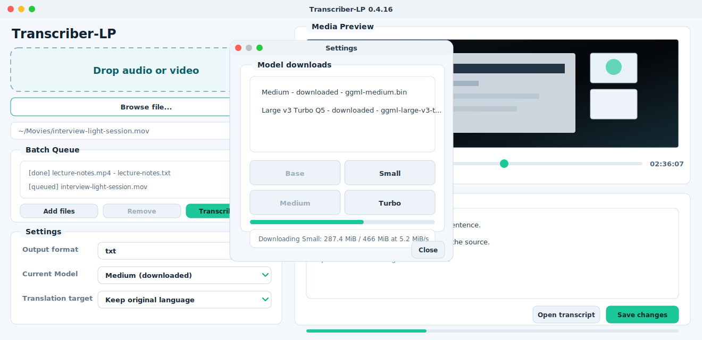

# Transcriber-LP User Manual

Current version: `0.4.18`

Versioning starts at `0.1.0` for the first tracked public-ready baseline. The source of truth is `app/version.py`.

## Start the App

Run the app from a development environment with:

```bash
python -m app.main
```

For a packaged build, open `dist/Transcriber-LP.app`.

## Interface Preview



## Transcribe a File

1. Drag an audio/video file into the drop area, or use `Browse file...`.
2. Choose the output format: `txt`, `srt`, or `vtt`.
3. Select a model from the model list.
4. Leave source language on `Auto-detect`, or choose a known language.
5. Keep the original language, or choose `Translate to English`.
6. Enable `Timestamped output` if you want timecodes in `txt` output and a timestamp CSV sidecar.
7. Click `Transcribe`.
8. Choose the output folder when prompted.

Use `Stop` to cancel a running transcription.

## Batch Import

Use `Add files` in the Batch Queue to import multiple audio or video files. Click `Transcribe batch`, choose one output folder, and Transcriber-LP processes the queue sequentially with the current model, language, translation, and output format settings.

Each queue item shows its status while the batch runs. Completed items keep their generated output path; select a completed item and click `Retrieve output` to load the source media in the preview player and open the generated transcript in the editor.

If multiple queued files share the same base filename, batch output names include a numeric suffix to avoid overwriting earlier files.

## Timestamp Export

`Timestamped output` adds timecodes to each line when the selected output format is `txt`. `srt` and `vtt` outputs already include timecodes in the main file.

The option also saves a `.csv` sidecar next to the main transcript using the same base filename. Treat it like the transcript itself: it can contain timing information and recognized text from the source media.

## Review and Correct a Transcript

When a media file is selected, the right side of the app loads it in the media preview player. Use `Play`, `Stop`, and the seek slider to review the source audio or video while checking the generated text.

When a transcription completes, the generated `txt`, `srt`, or `vtt` file opens automatically in the transcript editor. Correct the text directly and click `Save changes`; confirm the overwrite dialog to write the edits back to the same file.

Use `Open transcript` to load an existing transcript manually.

## Language Selection

`Auto-detect` asks `whisper-cli` to detect the spoken language automatically. The packaged command passes this explicitly as `-l auto`.

If the recording language is known, choose it directly. For example, Italian audio should use `Italian`, which passes `-l it` and avoids unnecessary language detection errors on long or noisy recordings.

## Troubleshooting

### Transcript Language Switching Mid-File

**Problem:** When using `Auto-detect`, a transcript that starts in one language (e.g., Italian) suddenly switches to another (e.g., English) partway through.

**Cause:** Whisper.cpp's automatic language detection may misclassify the source language, especially on audio with accents, background noise, or mixed-language content. The model may start with an incorrect language assumption and then "correct" itself when it detects a different pattern.

**Solution:** Use manual language selection instead of `Auto-detect`.

**Steps:**
1. Select your media file
2. In the **Source language** dropdown, choose the correct language (e.g., "Italian")
3. Do NOT use "Auto-detect"
4. Proceed with transcription

Manual language selection forces Whisper.cpp to use the specified language from the first frame, avoiding detection errors.

### Audio Quality and Language Detection

Poor audio quality increases the chance of language misdetection. If you experience language switching even with manual language selection, try:
- Using a longer segment of audio (Whisper benefits from more context)
- Checking the source audio for noise, compression, or encoding issues
- Testing with a shorter segment first to verify settings

### Translate to English

Currently, **translation to English is the only supported translation mode** because Whisper.cpp natively translates to English only. Other translation targets require external tools and are not included in this release.

To keep the original language, choose **"Keep original language"** in the Translation target dropdown.

## Appearance

Transcriber-LP starts with the light theme by default.

Use `View > Theme > Light` or `View > Theme > Dark` to switch the interface while the app is running. The selected theme is saved in user settings and restored on the next launch.

Dropdown menus highlight the option under the mouse. The `Browse file...` control is intentionally styled as a primary file-picking button so it is distinguishable from status text and input fields.

The log panel includes an `Auto-scroll` checkbox in the log header. When enabled, new log output keeps the panel pinned to the latest line. When disabled, the current scroll position is preserved so older output can be read while work continues. The checkbox uses a visible `x` marker when selected.

## Models

The app looks for models in this order:

1. downloaded models in `~/Library/Application Support/Transcriber-LP/models`
2. bundled models in the app/vendor resources

Use `Settings > Model downloads...` to download supported `whisper.cpp` models into the user models directory. The Settings dialog also shows installed or bundled models.

The main panel shows only `Current Model`. If no model is installed, it shows `click here to download a model`; clicking it opens Settings. Downloads are saved outside the app bundle and accepted only after checksum verification.

Only models with a checksum in `app/core/model_manager.py` are enabled for in-app download. Models without a checksum must be installed manually after their provenance is verified.

## Outputs

Transcription files are saved to the folder selected when transcription starts. The default output area used by the app is:

```text
~/Library/Application Support/Transcriber-LP/outputs
```

Batch outputs, edited transcripts, subtitle files, and timestamp CSV sidecars remain local user files. They are not uploaded by the app and are not part of the packaged application bundle.

## Packaging Requirements

Before building a macOS app bundle, provide these local files:

```text
third_party/macos/ffmpeg
third_party/macos/ffprobe
third_party/macos/whisper-cli
third_party/macos/<whisper-cli @rpath dylibs>
```

Use `otool -L third_party/macos/whisper-cli` to identify the `.dylib` files required by the local `whisper-cli` build. `scripts/build_whisper_cli.sh` copies these libraries for the default macOS build flow.

Model files are not bundled by default. If a release intentionally bundles `ggml-base.bin`, build with `TRANSCRIBER_LP_BUNDLE_MODEL=1` and complete the model provenance and license checks first.

Only distribute third-party binaries and models when their licenses allow it. Complete `docs/DISTRIBUTION_CHECKLIST.md` before publishing a release.

## Open-Source Licenses and Owners

Use `Help > Open-source licenses` inside the app to view the runtime attribution notice.

The app is intended to use only open-source components. The current third-party owners, licenses, and source URLs are documented in:

```text
docs/THIRD_PARTY_NOTICE.md
```

Before distributing a packaged app, verify the exact `ffmpeg`, `ffprobe`, `whisper-cli`, dynamic libraries, and model files you ship. Do not bundle proprietary binaries, codecs, or model weights with unclear redistribution terms.
